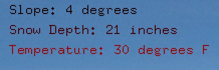
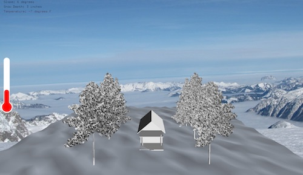
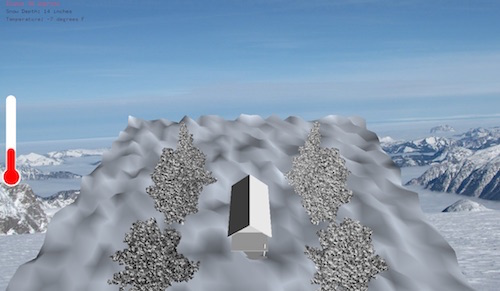
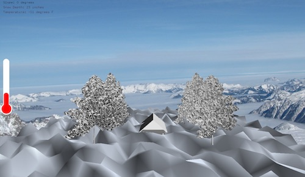
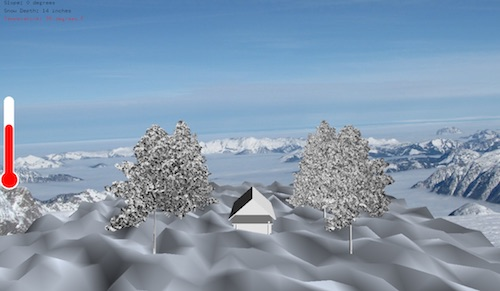
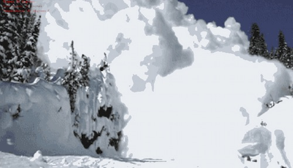

## Final Project - Avalanche Risk Visualizer

Although avalanches are natural disasters, they can be exacerbated due to unsafe human interaction. The goal of this program is to educate kids and/or reinforce which factors cause the most risk for an avalanche by having an interactive display. The goal is for the user to become more knowledgeable about avalanches, to take further actions to be safer, and to gain more confidence, resulting in less people being at risk. The factors that will be used are slope, temperature, and snow depth. 

The mountain is made out of a mesh. The program  uses Leap Motion and the ofxLeapMotion addon so that the program is based on the movement of your hands, implementing interactivity. The angle of your hand changes the slope, moving your hand up and down changes the snow depth, and moving your hand side to side changes the temperature. At the top left corner of the screen, the user can see the slope, snow depth, and temperature change based off of their hand movements. The more at risk they are, the more red the text appears:

When the program is first run, the user sees this screen:

The angle of your hand changes the slope:

The height of your hand changes the snow depth:

Note: The 3D house and trees allow the user to visualize the actual height of the snow.

Moving your hand left and right changes the temperature (which can be seen by the thermometer on the left):

The values of these three factors create a dangerous risk for avalanches. A slope between 25 and 45 degrees is prone to an avalanche, snow depth above 20 inches is prone to an avalanche, and a temperature above freezing is prone to an avalanche. If all three of these factors are in that zone, an avalanche occurs:

Note:
This program uses the ofxLeapMotion addon, the ofxGif addon, and the ofxAssimpModelLoader addon.